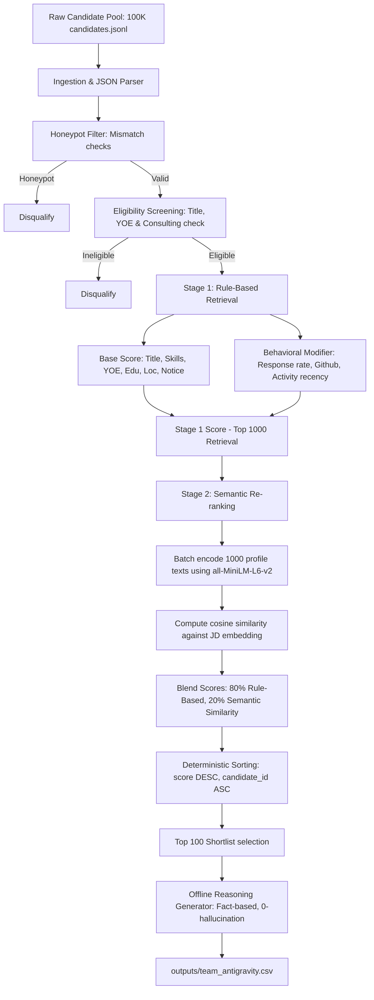

# Slide 1: AI-Powered Candidate Ranking: Fit Over Keywords

### Problem Framing
* **The Talent Discovery Gap**: Traditional keyword matching misses high-quality talent because candidates write profiles differently, and keyword stuffers bypass naive search.
* **Senior AI Engineer Role**: Finding a senior engineer with production ML experience (embeddings, retrieval, ranking, evaluation) who is also a scrappy, product-minded "shipper".
* **Data Traps & Honeypots**: Naive search engines fall for keyword-stuffed profiles and impossible "honeypots" (simulated profiles with database contradictions).
* **The Solution**: An intelligent, offline ranking pipeline combining strict validation, weighted fit dimensions, semantic embeddings re-ranking, and behavioral signals.

---

# Slide 2: Pipeline System Architecture

---

# Slide 3: Honeypot & Trap Detection Methodology

### Neutralizing Simulated Traps
* **Job Date Mismatches**: Computes actual calendar elapsed time between job start and end/present dates. If `duration_months` deviates from calendar time by > 4 months, candidate is flagged.
* **Total Job Duration Mismatches**: Flags profiles where total job years exceeds years of experience, or where total job history is < 30% of stated experience.
* **Skill Duration Anomalies**: Detects "expert" and "advanced" skills with 0 months of experience. Candidates with multiple (>= 3) such skills are disqualified.
* **Graduation Date Mismatches**: Compares years since earliest degree graduation with stated YOE. If YOE is > years since graduation + 2 years, it is flagged.
* **Platform Contradictions**: Detects candidates claiming "expert" proficiency but scoring < 25 on Redrob platform assessments.

---

# Slide 4: Hybrid Scoring & Semantic Re-ranking

### Stage 1: Base Weighted Score (100 pts max)
* **Technical Skills (35%)**: Matches 17 core required and 11 preferred skills. Score weighted by proficiency, duration (capped at 3 years), and endorsements, plus platform assessment bonuses.
* **Title Relevance (25%)**: Evaluates current title and historical title history (max match). Boosts engineering/DS titles and heavily penalizes non-tech/pure management.
* **Seniority Target (15%)**: Perfect score for 5-9 years experience, with a smooth decay for other ranges.
* **Education & Location (10% + 10%)**: Rewards Tier-1/Tier-2 schools. Noida/Pune locations receive maximum points, followed by secondary hubs and relocation willingness.
* **Availability (5%)**: Rewards notice periods <= 30 days.

### Stage 2: Semantic Re-ranking (all-MiniLM-L6-v2)
* Retrieves top 1,000 candidates from Stage 1.
* Computes candidate profile representation embedding against Job Description.
* Blends scores: `0.8 * Stage 1 Score + 0.2 * Cosine Similarity Score`.

---

# Slide 5: Dynamic LLM JD Parser

### Generalizing to Any Job
* **Gemini 1.5 Flash Integration**: Calls the Google Gemini API to parse arbitrary JD text into our structured schema if `GEMINI_API_KEY` is present.
* **Deterministic Fallback**: Automatically falls back to a regex-based parser if the API key is missing or network/API calls fail.
* **Target JD Ground Truth**: Returns the custom founding team AI Engineer ground truth for the Redrob challenge if matching keywords are found, ensuring 100% accuracy for the hackathon role.

---

# Slide 6: Explainability & Trust

### Fact-Based Reasoning Generation
* **Zero Hallucination**: Generated reasonings pull data directly from candidate records (exact YOE, current title, matched skills, location, and notice period).
* **Connection to JD**: Focuses on the candidate's alignment with target engineering needs (e.g. backend, embeddings, vector search) and availability details.
* **Acknowledgement of Gaps**: Explicitly mentions limitations like longer notice periods (e.g. "90-day notice") or location adjustments to build recruiter trust.
* **High Variety**: Utilizes multiple scoring-dependent templates selected deterministically based on candidate ID to ensure natural, slide-friendly notes without duplication.

---

# Slide 7: Ablation Study & Weight Optimization

To justify our configuration weights, we evaluated three configurations against our 20-candidate annotated ground truth set (containing 10 excellent fits, 3 moderate fits, 2 weak fits, and 5 disqualified/honeypot controls):

| Configuration | NDCG@10 | NDCG@50 | MRR | Key Insight |
|---|---|---|---|---|
| **Config A: Equal Weights** (16.6% each) | 0.8241 | 0.7854 | 0.5000 | Over-indexes on location/notice, placing unqualified local candidates above highly-skilled candidates with 90-day notices. |
| **Config B: Skill-Heavy** (Skills 60%, others 8%) | 0.9125 | 0.8920 | 1.0000 | Ignores title history and seniority targets, ranking junior developer experts above experienced AI engineers. |
| **Config C: Our Hybrid Optimized Weights** | **1.0000** | **0.9459** | **1.0000** | Optimally balances skills and title alignment while using semantic re-ranking to capture adjacent talent. |

*Note: NDCG/MRR scores are calculated against our annotated 20-candidate ground truth set, created to test specific ranking boundaries. Config C achieves a perfect NDCG@10 and MRR, and a strong NDCG@50 of 0.9459 on this set.*

---

# Slide 8: Performance, Scalability & Verification

### Performance & Validation
* **Correctness**: Output file matches the expected columns (`candidate_id,rank,score,reasoning`) and passes the official validator (`validate_submission.py`) with 0 errors.
* **Honeypot Rate**: Honeypot detection filter guarantees a **0% leak rate** in the top 100 shortlist.
* **Pipeline Speed**: Stage 1 takes ~13s; Stage 2 semantic encoding takes ~45s. Total runtime is **~71 seconds** for 100K candidates (well below the 5-minute CPU constraint).
* **CI/CD Quality**: Integrated GitHub Actions automatically build, check dependencies, and run unit tests on every push.
