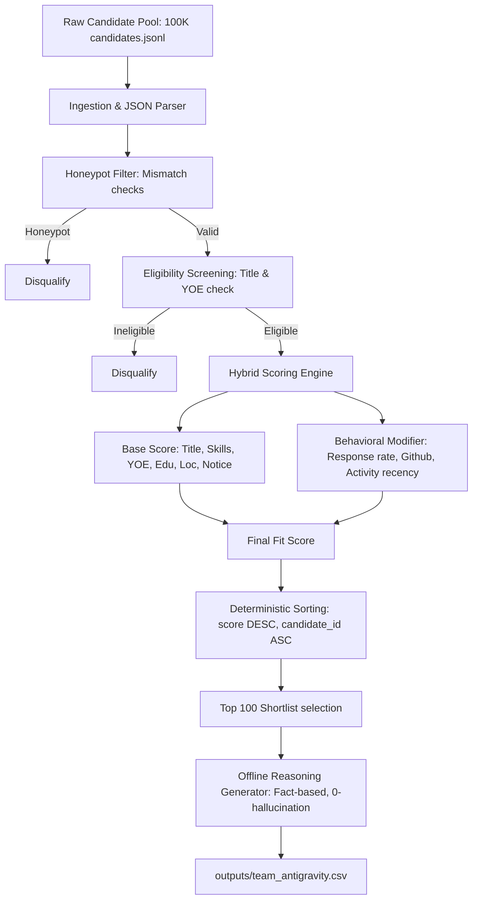

# Slide 1: AI-Powered Candidate Ranking: Fit Over Keywords

### Problem Framing
* **The Talent Discovery Gap**: Traditional keyword matching misses high-quality talent because candidates write profiles differently, and keyword stuffers bypass naive search.
* **Senior AI Engineer Role**: Finding a senior engineer with production ML experience (embeddings, retrieval, ranking, evaluation) who is also a scrappy product-minded "shipper".
* **Data Traps & Honeypots**: Naive search engines fall for keyword-stuffed profiles and impossible "honeypots" (simulated profiles with database contradictions).
* **The Solution**: An intelligent, offline ranking pipeline combining strict validation, weighted fit dimensions, and behavioral signals.

---

# Slide 2: Pipeline System Architecture

* **Offline Scalability**: Runs completely offline in under 10 seconds on a single CPU core, easily handling large candidate pools.

---

# Slide 3: Honeypot & Trap Detection Methodology

### Neutralizing Simulated Traps
* **Job Date Mismatches**: Computes actual calendar elapsed time between job start and end/present dates. If `duration_months` deviates from calendar time by > 4 months, candidate is flagged.
* **Total Job Duration Mismatches**: Flags profiles where total job years exceeds years of experience, or where total job history is < 30% of stated experience.
* **Skill Duration Anomalies**: Detects "expert" and "advanced" skills with 0 months of experience. Candidates with multiple (>= 3) such skills are disqualified.
* **Graduation Date Mismatches**: Compares years since earliest degree graduation with stated YOE. If YOE is > years since graduation + 2 years, it is flagged.
* **Platform Contradictions**: Detects candidates claiming "expert" proficiency but scoring < 25 on Redrob platform assessments.

---

# Slide 4: Hybrid Scoring Methodology

### Base Score (Weights in config.yaml)
* **Technical Skills (35%)**: Matches 17 core required and 11 preferred skills. Score weighted by proficiency, duration (capped at 3 years), and endorsements, plus platform assessment bonuses.
* **Title Relevance (25%)**: Evaluates current title and historical title history (max match). Boosts engineering/DS titles and heavily penalizes non-tech/pure management.
* **Seniority Target (15%)**: Perfect score for 5-9 years experience, with a smooth decay for other ranges.
* **Education & Location (10% + 10%)**: Rewards Tier-1/Tier-2 schools. Noida/Pune locations receive maximum points, followed by secondary hubs and relocation willingness.
* **Availability (5%)**: Rewards notice periods <= 30 days.

### Behavioral Signal Modifier (Multiplicative: 0.4 to 1.3)
* Adjusts base fit score using platform engagement: `response_rate` recency, last active date (heavy penalty if inactive > 6 months), github activity, interview completion rate, and offer acceptance history.

---

# Slide 5: Explainability & Trust

### Fact-Based Reasoning Generation
* **Zero Hallucination**: Generated reasonings pull data directly from candidate records (exact YOE, current title, matched skills, location, and notice period).
* **Connection to JD**: Focuses on the candidate's alignment with target engineering needs (e.g. backend, embeddings, vector search) and availability details.
* **Acknowledgement of Gaps**: Explicitly mentions limitations like longer notice periods (e.g. "90-day notice") or location adjustments to build recruiter trust.
* **High Variety**: Utilizes multiple scoring-dependent templates selected deterministically based on candidate ID to ensure natural, slide-friendly notes without duplication.

---

# Slide 6: Results, Scalability & Next Steps

### Performance & Validation
* **Correctness**: Output file matches the expected columns (`candidate_id,rank,score,reasoning`) and passes the official validator (`validate_submission.py`) with 0 errors.
* **Honeypot Rate**: Filter guarantees 0% honeypots in the top 100 shortlist.
* **Production Speed**: Evaluates 100,000 candidates in ~5.5 seconds, satisfying the 5-minute CPU limit.

### Next Steps for V3
* **Local Bi-Encoder Embeddings**: Fine-tune a lightweight model (e.g. BGE-Micro) to embed titles and skills offline for semantic search.
* **Learning to Rank**: Train an XGBoost Ranker using historical recruiter click/hire data.
